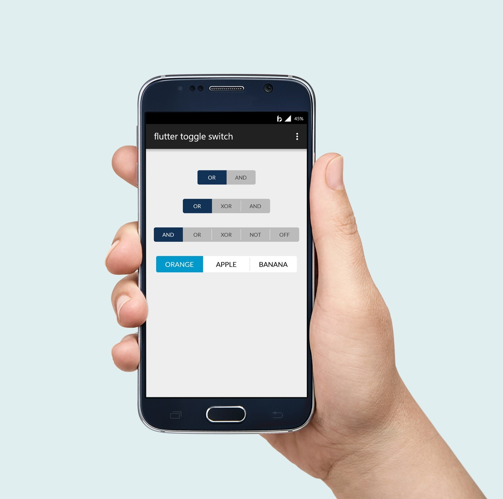

# flutter_toggle_switch

Thanks to: https://stackoverflow.com/users/10539074/eugene




## Basic Usage

```
ToggleWidget(
    activeBgColor: Colors.white,
    activeTextColor: Colors.black,
    inactiveBgColor: Colors.grey[400],
    inactiveTextColor: Colors.black,
    labels: [
      'AND',
      'XOR',
      'NOT',
      'NOT',
    ],
    initialLabel: 1,
    onToggle: (index) {
    },
),
```
